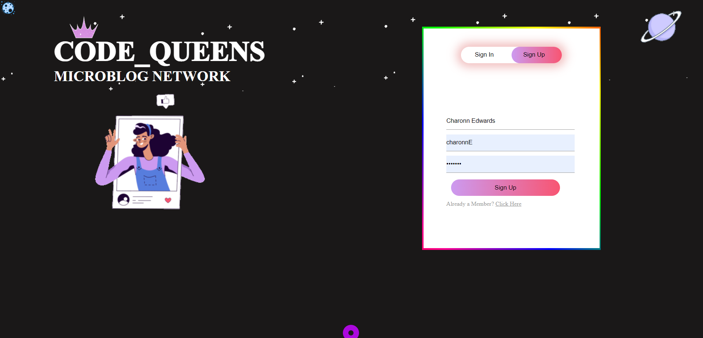
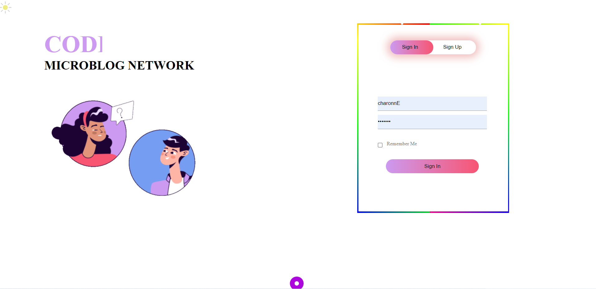
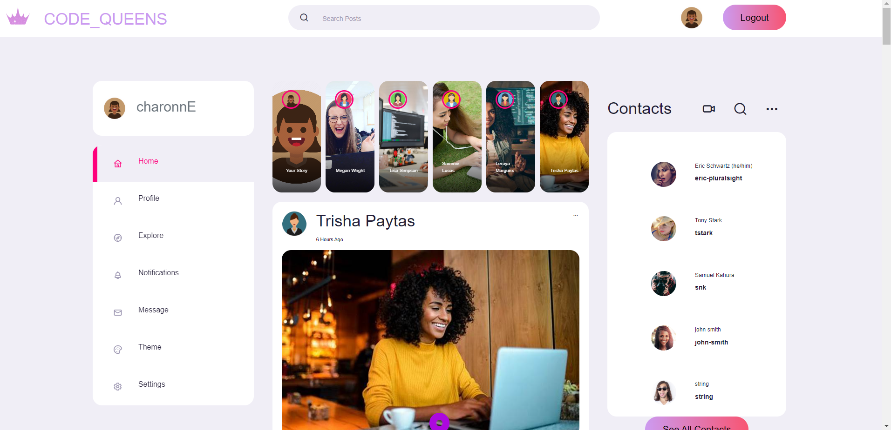
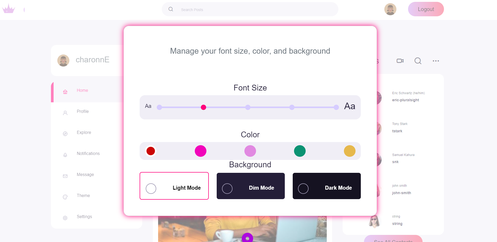
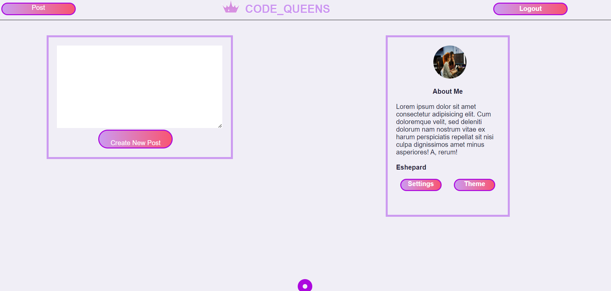

<!-- # Enjoy the Microblog Project and the MicroblogLite API!

Don't forget to read the [*MicroblogLite* API docs](https://microbloglite.herokuapp.com/docs/) and experiment with the API in *Postman!*

Practice and experimentation provide experience, and experience provides confidence. -->

# Microblog Network

Welcome to our Microblog! In this micblog we want to allow the user to:
Create a user account,
Login,
See all posts,
 and View the profile and Create a post from the profile page. There will be 4 Pages, they include: 
A Landing/Login page, 
A Registration page, 
A Posts page, 
A and Profile page.

## Authors

- [@Charonn412](https://github.com/Charonn412)
- [@Eshepard2](https://github.com/Eshepard2)
- [@Khanimhumbatovagit](https://github.com/khanimhumbatovagit)
- [@Amanda882](https://github.com/amanda882)

## Demo

READMEassets\Login to the Microblog Network! - Google Chrome 2023-01-06 10-39-14.mp4

## Features

- Light/dark mode toggle
- Font size toggle
- Fullscreen mode
- Auto-generated photos

## API Reference

#### Base Endpoint
```http
  https://microbloglite.herokuapp.com/api
```

#### Get all Posts

```http
  GET /api/posts
```

| Parameter | Type     | Description                |
| :-------- | :------- | :------------------------- |
| `api_key` | `string` | **Required**. Your API key |

#### Get all users

```http
  GET /api/users
```

| Parameter | Type     | Description                |
| :-------- | :------- | :--------------------------|
| `api_key` | `string` | **Required**. Your API key |

#### Post a new user

```http
  POST api/users
```

| Parameter | Type     | Description                |
| :-------- | :------- | :--------------------------|
| `api_key` | `string` | **Required**. Your API key |

#### Post a new logout

```http
  POST /auth/logout
```

| Parameter | Type     | Description                |
| :-------- | :------- | :--------------------------|
| `api_key` | `string` | **Required**. Your API key |

#### Post a new login

```http
  POST /auth/login
```

| Parameter | Type     | Description                |
| :-------- | :------- | :--------------------------|
| `api_key` | `string` | **Required**. Your API key |

#### Random Photo Generator

```http
  https://i.pravatar.cc/300
```

| Parameter | Type     | Description                |
| :-------- | :------- | :--------------------------|
| `Date.now()`| `variable` | **Required**. A random generated number |

## Sign Up Page(Dark Mode)



## Login Page



## Posts Page



## Posts Page (Theme)



## Profile Page

